# FarmLink – Data Flow Diagrams (DFD)

---

## 📌 Level 0 DFD — Context Diagram

> Shows the entire FarmLink system as a single process with all external entities.

```mermaid
flowchart LR
    Farmer(["👨‍🌾 Farmer"])
    Consumer(["🛒 Consumer"])
    Delivery(["🚚 Delivery Partner"])
    Firebase[("🔥 Firebase\nFirestore")]

    Farmer -- "Product Info, Profile, Farm Address" --> System["⚙️ FarmLink System"]
    Consumer -- "Browse, Order, Payment" --> System
    Delivery -- "Accept Delivery, Update Status" --> System
    System -- "Order Notifications, Earnings" --> Farmer
    System -- "Order Confirmation, Tracking" --> Consumer
    System -- "Pickup & Drop Details, Earnings" --> Delivery
    System <--> Firebase
```

---

## 📌 Level 1 DFD — Main Processes

> Breaks the system into major functional processes.

```mermaid
flowchart TD
    Farmer(["👨‍🌾 Farmer"])
    Consumer(["🛒 Consumer"])
    Delivery(["🚚 Delivery Partner"])
    DB[("🔥 Firestore DB")]

    Farmer --> P1["1.0\nFarmer Registration\n& Profile Mgmt"]
    Farmer --> P2["2.0\nProduct\nManagement"]
    Consumer --> P3["3.0\nConsumer\nRegistration & Login"]
    Consumer --> P4["4.0\nBrowse Products\n& Cart"]
    Consumer --> P5["5.0\nOrder Placement\n& Checkout"]
    Delivery --> P6["6.0\nDelivery Partner\nRegistration & Login"]
    Delivery --> P7["7.0\nOrder Acceptance\n& Delivery"]

    P1 -- "Store Profile & Farm Address" --> DB
    P2 -- "Store/Update Products" --> DB
    P3 -- "Store Consumer Profile" --> DB
    P4 -- "Read Products" --> DB
    P5 -- "Create Order (with Pickup Address)" --> DB
    P6 -- "Store Partner Profile" --> DB
    P7 -- "Update Order Status" --> DB

    DB -- "Order Notification" --> Farmer
    DB -- "Order Confirmation" --> Consumer
    DB -- "Available Orders" --> Delivery
```

---

## 📌 Level 2 DFD — Detailed Sub-Processes

### 2A: Product Management (Process 2.0)

```mermaid
flowchart TD
    Farmer(["👨‍🌾 Farmer"])
    PDB[("🔥 Products\nCollection")]
    FarmerApp["Farmer App"]

    Farmer --> P2_1["2.1\nAdd New Product\n(Name, Price, Unit, Image)"]
    Farmer --> P2_2["2.2\nEdit / Update\nProduct"]
    Farmer --> P2_3["2.3\nDelete Product"]
    Farmer --> P2_4["2.4\nView My Products\n& Stock"]

    P2_1 -- "Write Product Doc" --> PDB
    P2_2 -- "Update Product Doc" --> PDB
    P2_3 -- "Delete Product Doc" --> PDB
    PDB -- "Read Products" --> P2_4
    P2_4 --> FarmerApp
```

---

### 2B: Order Placement (Process 5.0)

---

### 2C: Order Delivery (Process 7.0)

---

## 📊 Data Stores Summary

| Data Store | Collection | Key Fields |
|---|---|---|
| Users | `users` | userId, role, name, email, phone, farmName, farmAddress |
| Products | `products` | productId, farmerId, name, price, unit, stock |
| Orders | `orders` | orderId, consumerId, farmerId, items, pickupAddress, farmerPhone, dropAddress, status |
| Delivery Partners | `users` (role=delivery) | userId, name, phone, vehicleType |
